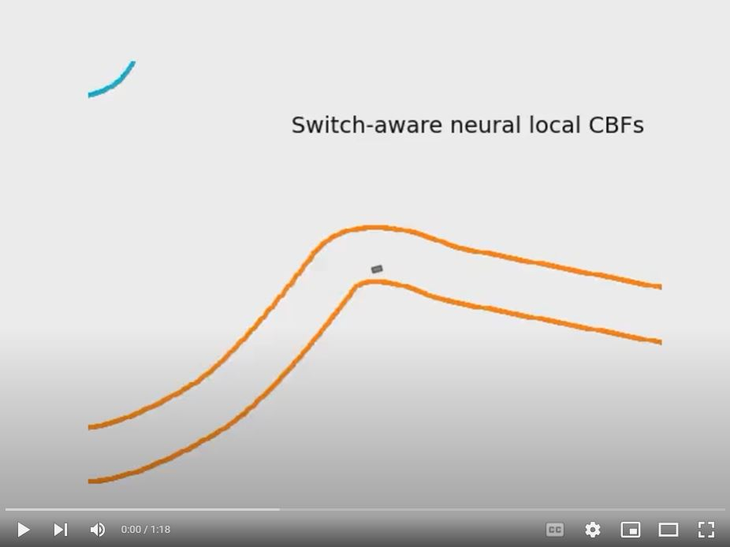

# Learning Local CBFs for Safety Control of Hybrid Systems
Preprint with supplementary material is available [online](https://arxiv.org/pdf/2401.14907.pdf).

## Install
The implementation has been tested with `Python 3.10` under `Ubuntu 22.04`. We recommend installing the simulation inside a virtualenv. You can install the environment by running:

```bash
virtualenv cbf_env
source cbf_env/bin/activate
git clone git@github.com:shuoyang2000/neural_hybrid_cbf.git
cd neural_hybrid_cbf
pip install -e .
```

Note that some supplementary libraries are included locally (in the `lib` folder).
These libraries are bundled with the repository as changes are made to make them adapted to our project.

#### Docker
We also provide a Dockerfile to build a container if you prefer.
```bash
docker build -t cbf_container -f Dockerfile .
```

## Reproduce the evaluation results

#### Python path
We run all experiments from the project directory so please add the project directory to the PYTHONPATH environment variable:
```
export PYTHONPATH=$PYTHONPATH:$
```

#### Evaluation commands

1. For the autnomous racing environment, please run from the project directory:
```
python3 scripts/racing/main.py
```
For visualization, please run from the project directory:
```
python3 scripts/racing/visualization.py
```
You may change the method (`mpc`, `local_switch_unaware_cbf`, `local_switch_aware_cbf`, `global_cbf`) in the file `scripts/racing/evaluation_config.py`.
The results will be saved under `results/racing_results/`.

[](https://youtu.be/aHg0p6zyGFg)

2. For the adaptive cruise control example, please run from the project directory:
```
python3 scripts/cruise_control/main.py
```
You may also run `mpc.py` similarly and test the costs by running `cost.py` in the same folder. Results will be saved under `results/acc_results/`.


## Training

The trained model is saved in
To reproduce the training, please run:
```bash
python3 train/train_acc.py --experiment_name experiment_acc --tMax 0. --tMin -1.1 --num_src_samples 10000 --pretrain --pretrain_iters 5000 --num_epochs 60000 --counter_end 50000
```

## Other issues:

1. F1/10th Car dynamics can be found [here](https://gitlab.lrz.de/tum-cps/commonroad-vehicle-models/blob/master/vehicleModels_commonRoad.pdf), please refer to Single-Track Model section.

2. Some related projects:
    - [The F1TENTH Gym environment](https://github.com/f1tenth/f1tenth_gym)
    - [DeepReach: A Deep Learning Approach to High-Dimensional Reachability](https://github.com/smlbansal/deepreach)
    - [refineCBF: Control Barrier Function refinement with HJ Reachability](https://github.com/UCSD-SASLab/refineCBF)
    - [hj_reachability: Hamilton-Jacobi reachability analysis in JAX](https://github.com/StanfordASL/hj_reachability)

3. Contact: if you have any question on this repo, please feel free to contact the author Shuo Yang (yangs1 at seas dot upenn dot edu) or raise an issue.


## Citation
If you find this work useful, please consider citing:

```
@article{yang2024learning,
  title={Learning Local Control Barrier Functions for Safety Control of Hybrid Systems},
  author={Yang, Shuo and Chen, Yu and Yin, Xiang and Mangharam, Rahul},
  journal={arXiv preprint arXiv:2401.14907},
  year={2024}
}
```
